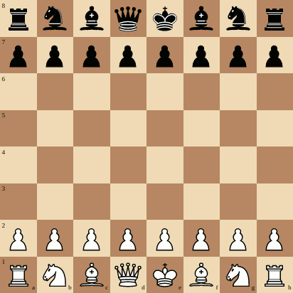

# react-chess

[](http://browsenpm.org/package/react-chess)[](https://travis-ci.org/rexxars/react-chess)

Renders a chess board using React

## Installation

```
npm install --save react-chess
```

## Demo

* [Basic but functional demo](https://rexxars.github.io/react-chess/)

## Usage

### Default lineup, movable pieces

```js
const React = require('react')
const ReactDOM = require('react-dom')
const Chess = require('react-chess')

ReactDOM.render(<Chess />, document.getElementById('main'))
```

### Specifying lineups

```js
const React = require('react')
const ReactDOM = require('react-dom')
const Chess = require('react-chess')

const lineup = ['R@h1', 'P@f2', 'q@d8', 'R@a1', 'P@a2', 'P@c2', 'b@c8', 'p@d7', 'Q@d1', 'n@g8']

ReactDOM.render(<Chess pieces={lineup} />, document.getElementById('main'))
```

## Properties

* `allowMoves` - _boolean_ Whether or not to allow piece movement (default: `true`)
* `highlightTarget` - _boolean_ Whether or not to highlight the target square on move (default:
  `true`)
* `drawLabels` - _boolean_ Whether or not to render labels (1-8, a-h) (default: `true`)
* `lightSquareColor` - _string_ Color to use for light squares (default: `#f0d9b5`)
* `darkSquareColor` - _string_ Color to use for dark squares (default: `#b58863`)
* `pieces` - _array_ Array of pieces to draw. Each item should be a piece in algebraic notation, for
  instance `Q@d1` for a white queen at square `d1`. (default: `Chess.getDefaultLineup()`)
* `onMovePiece` - _function_ Function that is called when a piece moves to a new position. Receives
  three arguments:
  * `piece` - _object_ Object with properties `notation` (`R@h1` etc), `name` (`R`), `position`
    (`h1`), `index` (index in `pieces` array)
  * `fromSquare` - _string_ Previous square position
  * `toSquare` - _string_ New square position
* `onDragStart` - _function_ Function that is called when a piece starts to move. Receives same
  arguments as `onMovePiece` except `toSquare`. Returning `false` from this function will prevent
  the dragging from happening.

## License

MIT © [Espen Hovlandsdal](https://espen.codes/)
